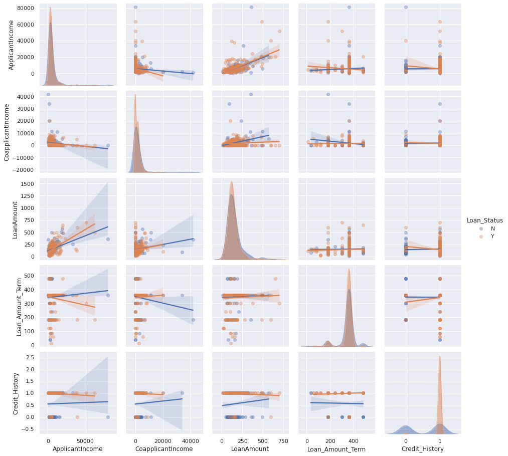

**Projekt do IB031**

- [Zdroj](https://www.kaggle.com/altruistdelhite04/loan-prediction-problem-dataset)

- [Testing csv](https://www.kaggle.com/altruistdelhite04/loan-prediction-problem-dataset/download/evL45lGV3RssadtbrRzN%2Fversions%2FvfUNmIbaXE87YsRW0vw8%2Ffiles%2Ftest_Y3wMUE5_7gLdaTN.csv?datasetVersionNumber=1)

- [Training csv](https://www.kaggle.com/altruistdelhite04/loan-prediction-problem-dataset/download/evL45lGV3RssadtbrRzN%2Fversions%2FvfUNmIbaXE87YsRW0vw8%2Ffiles%2Ftrain_u6lujuX_CVtuZ9i.csv?datasetVersionNumber=1)

In this project we will implement several models to predict credibility of a loan applicant. We will use the Loan Prediction Problem Dataset from Kaggle. The structure of the project is as follows:

1. Exploratory Analysis
2. Preprocessing of the dataset
3. Decision tree classifier
4. KNN classifier
5. Support Vector Machine
6. Deep Neural Network
7. Evaluation
8. Conclusion


## 1. Exploratory Analysis
The dataset consists of basic information about applicants. There are 13 columns with over 1000 rows. First of all, we will deal with the data types.


```python
import seaborn as sns
import pandas as pd
import numpy as np
import matplotlib as plt

sns.set()
```

Since pandas loads categorical data types as *'object'* dtype by default, we want to convert them back to category after loading the csv


```python
from sklearn.model_selection import train_test_split

#X_test = pd.read_csv("./test_Y3wMUE5_7gLdaTN.csv", index_col="Loan_ID")
dataset = pd.read_csv("./train_u6lujuX_CVtuZ9i.csv", index_col="Loan_ID")

for col in dataset.columns:
    if dataset[col].dtype == 'object':
        dataset[col] = dataset[col].astype('category')

X, y = dataset.drop(["Loan_Status"], axis=1), dataset["Loan_Status"][:]
y = y.map({"Y": True, "N": False})

X_train, X_test, y_train, y_test = train_test_split(X, y, test_size=.2)
```


```python
X.info()
```

    <class 'pandas.core.frame.DataFrame'>
    Index: 614 entries, LP001002 to LP002990
    Data columns (total 11 columns):
    Gender               601 non-null category
    Married              611 non-null category
    Dependents           599 non-null category
    Education            614 non-null category
    Self_Employed        582 non-null category
    ApplicantIncome      614 non-null int64
    CoapplicantIncome    614 non-null float64
    LoanAmount           592 non-null float64
    Loan_Amount_Term     600 non-null float64
    Credit_History       564 non-null float64
    Property_Area        614 non-null category
    dtypes: category(6), float64(4), int64(1)
    memory usage: 33.0+ KB
    

We have dropped the 'Loan_Status' column, which will provide labels during classification


```python
X.shape
```


    (614, 11)


```python
y.shape
```


    (614,)


The dataset had been split into training and testing subsets in around 1.67:1 ratio.

We can look at the amount of distinct values of selected features.


```python
# value count of just some selected columns

print(X.Gender.value_counts()) # oh yeah boi
print(X.Married.value_counts())
print(X.Education.value_counts())
print(X.Property_Area.value_counts())
```

    Male      489
    Female    112
    Name: Gender, dtype: int64
    Yes    398
    No     213
    Name: Married, dtype: int64
    Graduate        480
    Not Graduate    134
    Name: Education, dtype: int64
    Semiurban    233
    Urban        202
    Rural        179
    Name: Property_Area, dtype: int64
    


```python
X.head()
```


<div>
<style scoped>
    .dataframe tbody tr th:only-of-type {
        vertical-align: middle;
    }

    .dataframe tbody tr th {
        vertical-align: top;
    }

    .dataframe thead th {
        text-align: right;
    }
</style>
<table border="1" class="dataframe">
  <thead>
    <tr style="text-align: right;">
      <th></th>
      <th>Gender</th>
      <th>Married</th>
      <th>Dependents</th>
      <th>Education</th>
      <th>Self_Employed</th>
      <th>ApplicantIncome</th>
      <th>CoapplicantIncome</th>
      <th>LoanAmount</th>
      <th>Loan_Amount_Term</th>
      <th>Credit_History</th>
      <th>Property_Area</th>
    </tr>
    <tr>
      <th>Loan_ID</th>
      <th></th>
      <th></th>
      <th></th>
      <th></th>
      <th></th>
      <th></th>
      <th></th>
      <th></th>
      <th></th>
      <th></th>
      <th></th>
    </tr>
  </thead>
  <tbody>
    <tr>
      <th>LP001002</th>
      <td>Male</td>
      <td>No</td>
      <td>0</td>
      <td>Graduate</td>
      <td>No</td>
      <td>5849</td>
      <td>0.0</td>
      <td>NaN</td>
      <td>360.0</td>
      <td>1.0</td>
      <td>Urban</td>
    </tr>
    <tr>
      <th>LP001003</th>
      <td>Male</td>
      <td>Yes</td>
      <td>1</td>
      <td>Graduate</td>
      <td>No</td>
      <td>4583</td>
      <td>1508.0</td>
      <td>128.0</td>
      <td>360.0</td>
      <td>1.0</td>
      <td>Rural</td>
    </tr>
    <tr>
      <th>LP001005</th>
      <td>Male</td>
      <td>Yes</td>
      <td>0</td>
      <td>Graduate</td>
      <td>Yes</td>
      <td>3000</td>
      <td>0.0</td>
      <td>66.0</td>
      <td>360.0</td>
      <td>1.0</td>
      <td>Urban</td>
    </tr>
    <tr>
      <th>LP001006</th>
      <td>Male</td>
      <td>Yes</td>
      <td>0</td>
      <td>Not Graduate</td>
      <td>No</td>
      <td>2583</td>
      <td>2358.0</td>
      <td>120.0</td>
      <td>360.0</td>
      <td>1.0</td>
      <td>Urban</td>
    </tr>
    <tr>
      <th>LP001008</th>
      <td>Male</td>
      <td>No</td>
      <td>0</td>
      <td>Graduate</td>
      <td>No</td>
      <td>6000</td>
      <td>0.0</td>
      <td>141.0</td>
      <td>360.0</td>
      <td>1.0</td>
      <td>Urban</td>
    </tr>
  </tbody>
</table>
</div>


```python
X.isnull().sum()
```


    Gender               13
    Married               3
    Dependents           15
    Education             0
    Self_Employed        32
    ApplicantIncome       0
    CoapplicantIncome     0
    LoanAmount           22
    Loan_Amount_Term     14
    Credit_History       50
    Property_Area         0
    dtype: int64


As we can see, there are a lot of null values which will need to be imputed. Since there is no column with more missing data than present, we do not need to drop any.


```python
X.describe()
```


<div>
<style scoped>
    .dataframe tbody tr th:only-of-type {
        vertical-align: middle;
    }

    .dataframe tbody tr th {
        vertical-align: top;
    }

    .dataframe thead th {
        text-align: right;
    }
</style>
<table border="1" class="dataframe">
  <thead>
    <tr style="text-align: right;">
      <th></th>
      <th>ApplicantIncome</th>
      <th>CoapplicantIncome</th>
      <th>LoanAmount</th>
      <th>Loan_Amount_Term</th>
      <th>Credit_History</th>
    </tr>
  </thead>
  <tbody>
    <tr>
      <th>count</th>
      <td>614.000000</td>
      <td>614.000000</td>
      <td>592.000000</td>
      <td>600.00000</td>
      <td>564.000000</td>
    </tr>
    <tr>
      <th>mean</th>
      <td>5403.459283</td>
      <td>1621.245798</td>
      <td>146.412162</td>
      <td>342.00000</td>
      <td>0.842199</td>
    </tr>
    <tr>
      <th>std</th>
      <td>6109.041673</td>
      <td>2926.248369</td>
      <td>85.587325</td>
      <td>65.12041</td>
      <td>0.364878</td>
    </tr>
    <tr>
      <th>min</th>
      <td>150.000000</td>
      <td>0.000000</td>
      <td>9.000000</td>
      <td>12.00000</td>
      <td>0.000000</td>
    </tr>
    <tr>
      <th>25%</th>
      <td>2877.500000</td>
      <td>0.000000</td>
      <td>100.000000</td>
      <td>360.00000</td>
      <td>1.000000</td>
    </tr>
    <tr>
      <th>50%</th>
      <td>3812.500000</td>
      <td>1188.500000</td>
      <td>128.000000</td>
      <td>360.00000</td>
      <td>1.000000</td>
    </tr>
    <tr>
      <th>75%</th>
      <td>5795.000000</td>
      <td>2297.250000</td>
      <td>168.000000</td>
      <td>360.00000</td>
      <td>1.000000</td>
    </tr>
    <tr>
      <th>max</th>
      <td>81000.000000</td>
      <td>41667.000000</td>
      <td>700.000000</td>
      <td>480.00000</td>
      <td>1.000000</td>
    </tr>
  </tbody>
</table>
</div>


Here we have some essential statistics about our dataset. For instance, we can see, that the most frequent length of loan term is about 1 year, with maximum being 1.5 year and minimum just 12 days. Furthermore, coapplicants have much lower income than applicants.


```python
sns.heatmap(X.corr(), annot=True, vmin=-0.3, cmap="viridis", fmt=".2f")
```


    <matplotlib.axes._subplots.AxesSubplot at 0x7f5dbff4b5f8>


We also computed and plotted correlation matrix of features in the dataset. There is only one pair of features, loan amount and applicant income, which can be considered to be mildly positively correlated. Other features, have nearly no correlation among them. This results is quite suprising, as one would expect higher correlation of features.


```python
X.hist(bins=40, log=True)
```


    array([[<matplotlib.axes._subplots.AxesSubplot object at 0x7f5dfc30c128>,
            <matplotlib.axes._subplots.AxesSubplot object at 0x7f5dbfbb78d0>],
           [<matplotlib.axes._subplots.AxesSubplot object at 0x7f5dbf6222b0>,
            <matplotlib.axes._subplots.AxesSubplot object at 0x7f5dbf632c50>],
           [<matplotlib.axes._subplots.AxesSubplot object at 0x7f5dbe011630>,
            <matplotlib.axes._subplots.AxesSubplot object at 0x7f5dbf51efd0>]],
          dtype=object)


Most of the features are scattered along the x-axis. The only exception is Loan Amount, which roughly follows the normal distribution.


```python
sns.countplot(y)
```


    <matplotlib.axes._subplots.AxesSubplot at 0x7f5dbde41240>


```python
sns.pairplot(dataset, hue="Loan_Status", diag_kind="hist", kind="reg", diag_kws={"histtype": "barstacked", "alpha": 0.5}, plot_kws={"scatter_kws": {"alpha": 0.35}})
```


    <seaborn.axisgrid.PairGrid at 0x7f5dbdd54ac8>





Credit history seems to have the highest impact on deciding whether the loan should be approved or not. Clients with low credit score seem more likely to be denied.

There are some cases where ApplicantIncome and CoapplicantIncome are very low, their loan request gets approved, whereas in a few cases the CoapplicantIncome is very high and ApplicantIncome is very low, the request gets denied.

## 2. Data preprocessing


```python
y.isna().sum()
```


    0


Good, there are no N/A labels. We do not need to drop any whole rows.

First, let's encode categorical values with OneHotEncoding


```python
from sklearn.preprocessing import OrdinalEncoder, OneHotEncoder, StandardScaler
from sklearn.pipeline import make_pipeline
from sklearn.compose import make_column_transformer
from sklearn.impute import SimpleImputer
from sklearn_pandas import DataFrameMapper

class NpToDf:
    columns = []

    def __init__(self, columns=None):
        self.columns = columns

    def fit(self, X, *args, **kwargs):
        return X

    def fit_transform(self, X, *args, **kwargs):
        return self.transform(X)

    def transform(self, X, *args, **kwargs):
        return pd.DataFrame(data=X, columns=self.columns)

pipe_X = make_pipeline(
    SimpleImputer(missing_values=np.nan, strategy="most_frequent"),
    NpToDf(X_train.columns),
    make_column_transformer(
        (OneHotEncoder(), ['Gender', 'Married', 'Education', 'Self_Employed', 'Property_Area', 'Dependents']),
        remainder=StandardScaler()),
    NpToDf(),
)

pipe_y = make_pipeline(
    OrdinalEncoder()
)


```


```python
pipe_X.fit_transform(X_train)
train_X = pipe_X.transform(X_train)
test_X = pipe_X.transform(X_test)

train_y = pipe_y.fit_transform(y_train.to_numpy().reshape(-1, 1)).reshape(-1)
test_y = pipe_y.fit_transform(y_test.to_numpy().reshape(-1, 1)).reshape(-1)
```

Some helper functions for training and evaluation of our models.


```python
from sklearn.metrics import mean_squared_error, f1_score
from sklearn.model_selection import cross_val_score
import matplotlib.pyplot as plt

def evaluate(clf, X_test, y_test):
    y_pred = clf.predict(X_test)
    scores = cross_val_score(clf, X_test, y_test, cv=10)

    print(f"RMSE: {mean_squared_error(y_test, y_pred, squared = False):.4f}")   
    print(f"Accuracy: {scores.mean():.3f} ± {scores.std() * 2:.3f}")
    print("F1 Score: %.2f" % f1_score(y_test, y_pred, average='weighted'))
```


```python
from sklearn.metrics import plot_roc_curve

def roc(clf, test_X, test_y):
    plot_roc_curve(clf, test_X, test_y)
    plt.plot([0, 1], [0, 1], linestyle='--', lw=2, color='r', label='Chance', alpha=.8)
    plt.legend()
```


```python
from sklearn.metrics import plot_precision_recall_curve
from sklearn.metrics import precision_recall_curve

def prc(clf, test_X, test_y):
    plot_precision_recall_curve(clf, test_X, test_y)

```


```python
from sklearn.metrics import plot_confusion_matrix
from sklearn.metrics import confusion_matrix
from sklearn.model_selection import GridSearchCV

def confusion(clf, X_test, y_test):
    plot_confusion_matrix(clf, X_test, y_test, cmap=plt.cm.Blues)    
                        
```


```python
def get_gscv(clf, param_grid):
    gs = GridSearchCV(clf, param_grid)
    gs.fit(train_X, train_y)
    score = gs.score(test_X, test_y)
    print(f"Best parameters: {gs.best_params_}, with F1 score of {score:.2f}")
    return (score, gs.best_params_)
```

In the following 4 sections, we will always start by running a grid search tuning hyperparameters of our models.

## 3. Decision tree classifier


```python
from sklearn.tree import DecisionTreeClassifier

dtree_clf = DecisionTreeClassifier()
dtree_values = {"criterion": ["gini", "entropy"],
                "max_depth": [1, 2, 5, 10, 16, None],
                "max_leaf_nodes": [6, 8, 10, 12, 20, None],
                "max_features": ["auto", "sqrt", "log2", 2, 4, 8]}
                
score, params = get_gscv(dtree_clf, dtree_values)
```

    Best parameters: {'criterion': 'entropy', 'max_depth': None, 'max_features': 8, 'max_leaf_nodes': 12}, with F1 score of 0.75
    


```python
tree_clf = DecisionTreeClassifier(**params)
tree_clf.fit(train_X, train_y)
evaluate(tree_clf, test_X, test_y)
roc(tree_clf, test_X, test_y)
prc(tree_clf, test_X, test_y)
confusion(tree_clf, test_X, test_y)
plt.show()

```

    RMSE: 0.4771
    Accuracy: 0.657 ± 0.248
    F1 Score: 0.75
    


## 4. KNN classifier


```python
from sklearn.neighbors import KNeighborsClassifier

knn_clf = KNeighborsClassifier()
knn_values = {"n_neighbors": list(range(2, 16, 2)), 
              "algorithm": ["auto", "ball_tree", "kd_tree", "brute"],
              "leaf_size": [10, 20, 30, 40, 50], 
              "p": [1, 2], 
              "weights": ["uniform", "distance"]}
              
score, params = get_gscv(knn_clf, knn_values)
```

    Best parameters: {'algorithm': 'auto', 'leaf_size': 10, 'n_neighbors': 14, 'p': 2, 'weights': 'uniform'}, with F1 score of 0.80
    


```python
knn_clf = KNeighborsClassifier(**params)
knn_clf.fit(train_X, train_y)
evaluate(knn_clf, test_X, test_y)
roc(knn_clf, test_X, test_y)
prc(knn_clf, test_X, test_y)
confusion(knn_clf, test_X, test_y)
plt.show()
```

    RSME: 0.4508
    Accuracy: 0.803 ± 0.138
    F1 Score: 0.78
    


## 5. Support Vector Machine


```python
from sklearn.svm import SVC

svc_clf = SVC()
svc_values = {"C": [.8, 1.0, 1.2, 1.5, 2.0],
              "kernel": ["linear","poly","rbf","sigmoid"],
              "degree": [2, 3, 4, 5], 
              "gamma": ["scale", "auto"], 
              "coef0": [.0, .5, 1.0, 1.5]}
              
score, params = get_gscv(svc_clf, svc_values)
```

    Best parameters: {'C': 1.0, 'coef0': 1.5, 'degree': 2, 'gamma': 'scale', 'kernel': 'sigmoid'}, with F1 score of 0.78
    


```python
svm_clf = SVC(**params)
svm_clf.fit(train_X, train_y)

evaluate(svm_clf, test_X, test_y)
roc(svm_clf, test_X, test_y)
prc(svm_clf, test_X, test_y)
confusion(svm_clf, test_X, test_y)
plt.show()
```

    RSME: 0.4685
    Accuracy: 0.699 ± 0.079
    F1 Score: 0.76
    


## 6. Deep Neural Network


```python
from tensorflow import keras
import tensorflow as tf
from keras.models import Sequential

from keras.layers import Dense
from sklearn.metrics import classification_report, confusion_matrix
from tensorflow.keras import layers


print(y_train.shape)
```

    (491,)
    


```python
nn = Sequential()

nn.add(Dense(units=128, activation='relu', input_shape=(train_X.shape[1],)))
nn.add(Dense(units=64, activation='relu'))
nn.add(Dense(units=32, activation='relu'))
nn.add(Dense(units=2, activation='softmax')) 

nn.compile(loss='categorical_crossentropy', optimizer='adam', metrics=['accuracy'])

nn.summary()
```

    Model: "sequential_1"
    _________________________________________________________________
    Layer (type)                 Output Shape              Param #   
    =================================================================
    dense_1 (Dense)              (None, 128)               2688      
    _________________________________________________________________
    dense_2 (Dense)              (None, 64)                8256      
    _________________________________________________________________
    dense_3 (Dense)              (None, 32)                2080      
    _________________________________________________________________
    dense_4 (Dense)              (None, 2)                 66        
    =================================================================
    Total params: 13,090
    Trainable params: 13,090
    Non-trainable params: 0
    _________________________________________________________________
    


```python
ohe = OneHotEncoder()

nn_train_y = ohe.fit_transform(y_train.to_numpy().reshape(-1, 1))
nn_test_y = ohe.transform(y_test.to_numpy().reshape(-1, 1))

data = nn.fit(train_X, nn_train_y, batch_size=32, epochs=10, verbose=False)

predicted_y = nn.predict(test_X)

history_df = pd.DataFrame(data=data.history, columns=data.history.keys())

sns.lineplot(legend='full', y='loss', x=range(len(data.history['loss'])), data=history_df)
plt.show()
sns.lineplot(legend='full', y='accuracy', x=range(len(data.history['accuracy'])), data=history_df)
plt.show()

predicted_y_labels = np.argmax(predicted_y, axis=1)

true_y_labels = np.argmax(nn_test_y, axis=1) 

# evaluate(nn, test_X, nn_test_y)

sns.heatmap(confusion_matrix(true_y_labels, predicted_y_labels), annot=True)

print('\nClassification Report')
target_names = ["Y", "N"]
print(classification_report(true_y_labels, predicted_y_labels, target_names=target_names))
```


    
    Classification Report
                  precision    recall  f1-score   support
    
               Y       0.59      0.54      0.56        41
               N       0.78      0.82      0.80        82
    
        accuracy                           0.72       123
       macro avg       0.69      0.68      0.68       123
    weighted avg       0.72      0.72      0.72       123
    
    


## 7. Evaluation


## 8. Conclusion
